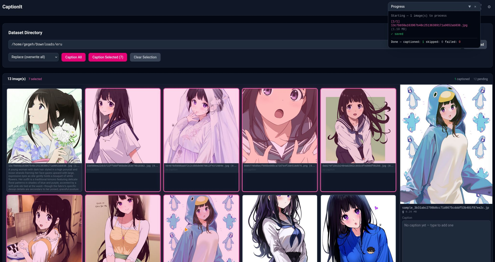

# CaptionIt

CaptionIt is a local-first image captioning app for building dataset captions quickly.
It scans a folder of images, captions them using any OpenAI-compatible model backend (Ollama, Venice, OpenAI, etc.), and saves editable `.txt` files next to each image.



---

## Quick Start

### 1. Install Bun

If you don't have Bun installed:

```sh
curl -fsSL https://bun.com/install | bash
```

Then restart your terminal.

Please visit https://bun.com/docs/installation for up to date instructions for your platform.

### 2. Download CaptionIt

```sh
git clone https://github.com/gegehprast/captionit.git
cd captionit
bun install
```

### 3. Run

```sh
./start.sh
```

Then open `http://localhost:3001` in your browser.

---

## Configuration

On first run `./start.sh` will create `dist/.env` from the example file automatically. Open it and fill in your model backend details:

```sh
# URL of your OpenAI-compatible API
DEFAULT_SERVICE_HOST=https://api.venice.ai/api/v1

# API key — leave blank if your backend doesn't require one (e.g. local Ollama)
DEFAULT_SERVICE_API_KEY=your-api-key-here

# The model to use for captioning
DEFAULT_MODEL_NAME=gemma-4-uncensored

# Images larger than this (in pixels) are downscaled before being sent to the model.
DEFAULT_MAX_RESOLUTION=1024
```

Save the file and restart the app. These become the default values pre-filled in the Settings panel — you can override any of them per-session without editing the file.

> **💡 Using Ollama on your local machine?** If you haven't tinkered with its configuration yet, set `DEFAULT_SERVICE_HOST=http://localhost:11434/v1` and leave `DEFAULT_SERVICE_API_KEY` blank.

---

## Updating

```sh
./update.sh
```

This pulls the latest changes and rebuilds if anything changed. Your `.env` settings are preserved.

---

## Usage

1. **Pick a folder** — use the directory browser to navigate to your images.
2. **Choose a mode:**
   - **Store** — only caption images that don't have one yet
   - **Append** — add to existing captions
   - **Replace** — overwrite all captions
3. **Click Start.** The progress feed shows each image as it's processed.
4. **Review & edit** — click any image in the list to read or edit its caption.

The **Settings** panel (⚙ top right) lets you change the model, API key, instruction prompt, and max resolution for the current session. **Load server defaults** resets them to what's in your `.env`.

---

## For Developers

### Requirements

- [Bun](https://bun.sh) v1.3.3 or later

### Setup

```sh
bun install
cp apps/backend/.env.example apps/backend/.env.local
# edit apps/backend/.env.local
```

### Dev Servers

```sh
# Terminal 1 — backend
bun run backend:dev

# Terminal 2 — frontend
bun run frontend:dev
```

Open `http://localhost:5173`.

### Build

```sh
bun run build          # frontend + backend → dist/
bun run start          # runs dist/run.sh
./start.sh --rebuild   # force rebuild then start
```

### Other Scripts

```sh
bun run backend:typecheck        # type-check the backend
bun run frontend:typecheck       # type-check the frontend
bun run backend:openapi:generate # regenerate OpenAPI types from backend routes
bun run check                    # format (Biome)
bun run lint                     # lint (Biome)
```

### Environment Variables

Key variables in `apps/backend/.env.local`:

| Variable | Description | Default |
|---|---|---|
| `DEFAULT_SERVICE_HOST` | Base URL of the OpenAI-compatible API | `http://localhost:11434/v1` |
| `DEFAULT_SERVICE_API_KEY` | API key (leave blank if not required) | _(empty)_ |
| `DEFAULT_MODEL_NAME` | Model name | `huihui_ai/qwen3-vl-abliterated:4b-instruct` |
| `DEFAULT_MAX_RESOLUTION` | Max image dimension before downscaling (px) | `1024` |
| `PORT` | Port the server listens on | `3001` |
| `LOG_LEVEL` | Log verbosity: `none` `error` `warn` `info` `debug` `trace` | `info` |
